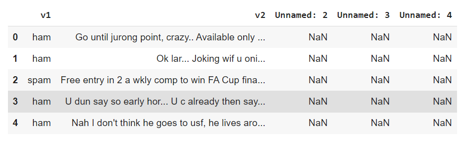
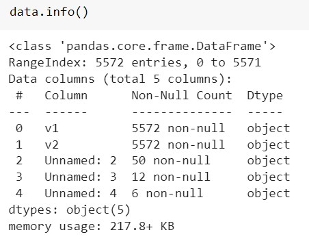
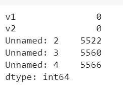
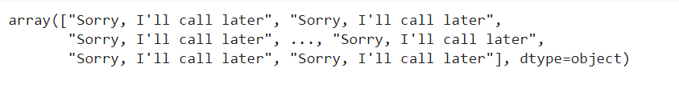
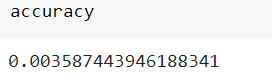

# Implementation-of-SVM-For-Spam-Mail-Detection

## AIM:
To write a program to implement the SVM For Spam Mail Detection.

## Equipments Required:
1. Hardware – PCs
2. Anaconda – Python 3.7 Installation / Moodle-Code Runner

## Algorithm
1. Import the required libraries and read the dataset.
2. Check for null values and split the dataset.
3. Convert the dataset to a vector of term/token counts using CountVectorizer.
4. Import SVC to apply linear kernel function.
5. Import metrics to predict the accuracy.

## Program:
```
'''
Program to implement the SVM For Spam Mail Detection..
Developed by: Gautham M 
RegisterNumber:  212221230027
'''
import pandas as pd
data=pd.read_csv("/content/drive/MyDrive/intro to ml/ex8/spam.csv",encoding='latin-1')
data.head()
data.info()
data.isnull().sum()
x=data["v1"].values
y=data["v2"].values
from sklearn.model_selection import train_test_split
x_train,x_test,y_train,y_test=train_test_split(x,y,test_size=0.2,random_state=0)
from sklearn.feature_extraction.text import CountVectorizer
cv=CountVectorizer()
x_train=cv.fit_transform(x_train)
x_test=cv.transform(x_test)
from sklearn.svm import SVC
svc=SVC()
svc.fit(x_train,y_train)
y_pred=svc.predict(x_test)
y_pred
from sklearn import metrics
accuracy=metrics.accuracy_score(y_test,y_pred)
accuracy
```

## Output:

### Head:

### Info:

### Null value:

### Y Predict:

### Accuracy:


## Result:
Thus the program to implement the SVM For Spam Mail Detection is written and verified using python programming.
